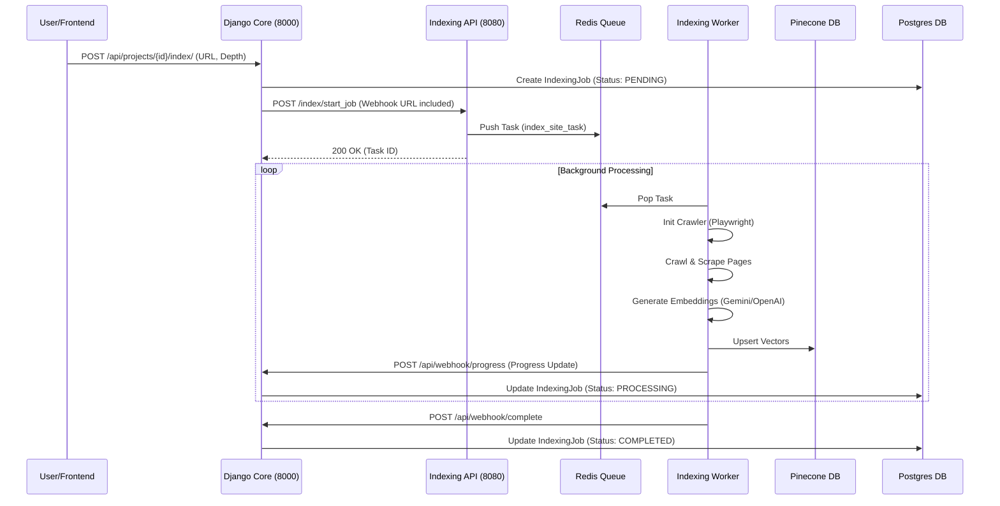

# Lawa AI Platform - System Architecture

## 1. High-Level Overview

The Lawa AI Platform is built on a **Microservices-oriented Architecture**, deployed via Docker Compose on a single DigitalOcean Droplet. It consists of three main backend services orchestrating User Management, Website Indexing, and RAG (Retrieval-Augmented Generation) Chat.

### System Components

| Service | Technology | Port | Role |
| :--- | :--- | :--- | :--- |
| **Core Backend** | Django / DRF | `8000` | User management, Project configuration, Orchestration, Billing. |
| **Indexing Engine** | FastAPI + Celery | `8080` | High-performance website crawling, scraping, and vector embedding. |
| **Chatbot API** | FastAPI | `8002` | Low-latency chat widget backend handling RAG and LLM inference. |
| **Database** | PostgreSQL 15 | `5432` | **Managed (DO)**. Shared relational data (Users, Projects, Chat Logs). |
| **Queue** | Redis 7 | `6379` | Message broker for Celery and caching. |
| **Vector DB** | Pinecone | N/A | External SaaS storage for vector embeddings. |

---

## 2. Infrastructure & Deployment

The system is containerized and managed via a unified `docker-compose.yml` in the project root.

### Network Topology
*   **Docker Network (`lawa-network`)**: All internal communication happens over this private bridge network.
*   **Service Discovery**: Containers access each other via hostname (e.g., `http://indexing-service:8080`).
*   **Data Persistence**:
    *   **Postgres**: Managed externally (DigitalOcean Managed DB).
    *   **Redis**: Local container with volume persistence.
    *   **Shared Data**: `shared_data` volume for passing temporary files if strictly necessary (though mostly API-driven).

### Service Configuration
*   **Django (`backend`)**:
    *   Runs via `gunicorn`.
    *   Connects to Redis DB `1`.
    *   Exposes API for Frontend Board/Dashboard.
*   **Indexing (`indexing-service`)**:
    *   Runs via `uvicorn`.
    *   Connects to Redis DB `2` (isolated queue).
    *   Background Workers: Scalable `celery` workers running **Playwright** browsers.
*   **Chatbot (`chatbot-service`)**:
    *   Runs via `python main.py` (Uvicorn).
    *   Optimized for read-heavy RAG operations.

---

## 3. Workflows & Data Application

### A. Website Indexing Workflow
This flow describes how a user requests a website index and how the system processes it.



### B. Chat Workflow (RAG)
This flow handles the end-user chatting with the embedded widget.

```mermaid
graph LR
    User[Visitor] -- "Message" --> Widget[Chat Widget]
    Widget -- "POST /chat" --> ChatAPI[Chatbot API (8002)]
    
    subgraph "RAG Pipeline"
        ChatAPI -- "Query -> Vector" --> Embed[Embedding Model]
        Embed --> ChatAPI
        ChatAPI -- "Similarity Search" --> Pinecone[(Pinecone)]
        Pinecone -- "Retrieved Context" --> ChatAPI
        ChatAPI -- "Context + Query" --> LLM[LLM (OpenAI/Gemini)]
        LLM -- "Generated Answer" --> ChatAPI
    end
    
    ChatAPI -- "Save Log" --> DB[(Postgres)]
    ChatAPI -- "Response" --> Widget
```

---

## 4. Key Integration Points

### 1. Authentication
*   **Django**: Uses JWT (SimpleJWT) for Dashboard access.
*   **Inter-Service**: Services use **API Tokens** (defined in `.env` as `INDEXING_API_TOKEN`, etc.) to trust requests between Django and Indexing API.

### 2. State Management
*   **Indexing State**: Maintained in Postgres (`IndexingJob` table). The Indexing Service is stateless regarding job history; it only executes what it's told and reports back.
*   **Chat History**: Stored in Postgres (`ChatMessage` table) associated with the `SessionID`.

### 3. Scalability
*   The **Indexing Worker** is decoupled from the API. We can scale `celery-worker` instances horizontally (`docker-compose up -d --scale indexing-worker=3`) to handle higher crawling throughput without affecting API responsiveness.

---

## 5. Development to Production

### Local Development
*   Uses `docker-compose.yml`.
*   `.env` files usually point to local dev services or sandbox credentials.

### Production (DigitalOcean)
*   **Database**: Switch to Managed Database User/Host in `.env`.
*   **Redis**: Remains containerized (single node is sufficient for current scale).
*   **Secrets**: `SECRET_KEY`, `API_KEY`s must be secured in `.env` (not committed).
