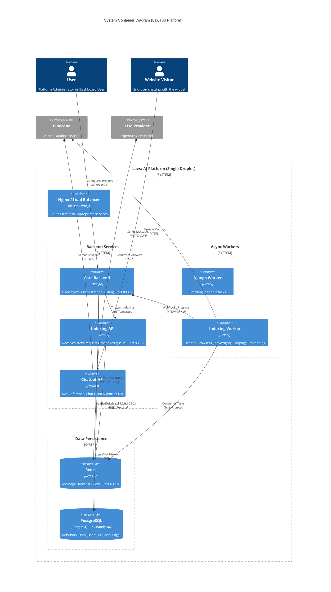
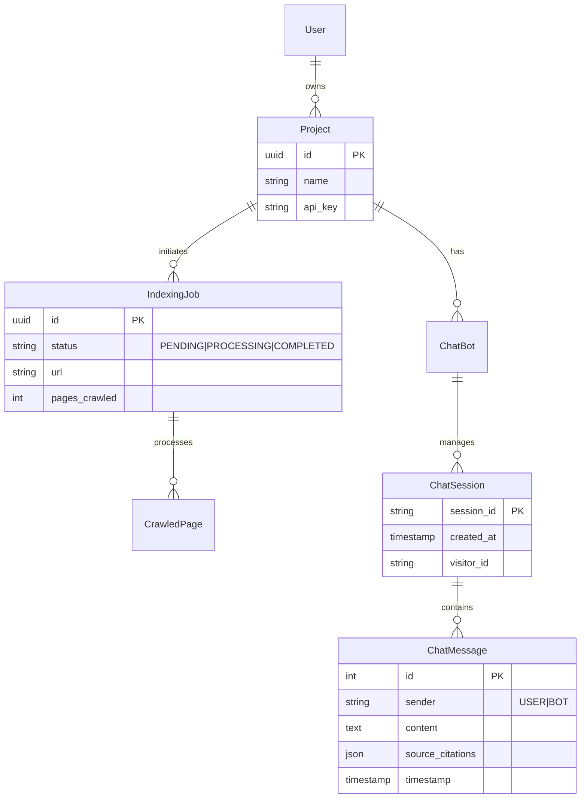
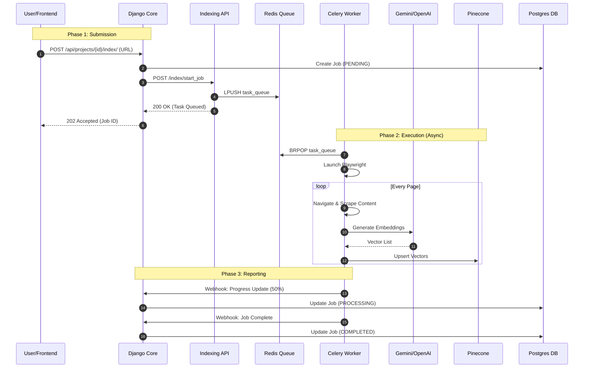

# Lawa AI Platform - System Architecture

## 1. High-Level System Architecture

The Lawa AI Platform uses a **Microservices-oriented Architecture** deployed on a single DigitalOcean Droplet using Docker Compose. It orchestrates three main functional areas: **Management** (Django), **Indexing** (FastAPI+Celery), and **Inference** (FastAPI).

### System Container Diagram



---

## 2. Infrastructure & Deployment

The system is unified under a single `docker-compose.yml`.

### Network Topology
*   **Docker Network (`lawa-network`)**: Private bridge network.
*   **Service Discovery**: `http://indexing-service:8080`, `http://chatbot-service:8002`.
*   **Peristence**:
    *   **Postgres**: External Managed DB.
    *   **Redis**: Local Container.

---

## 3. Data Architecture (ER Diagram)

This diagram highlights the key relationships between Projects, Indexing Jobs, and Chat Sessions.



---

## 4. Workflows & Data Application

### A. Website Indexing Workflow (Parallel Processing)

This flow details how a URL is turned into vector embeddings.



### B. RAG Chat Workflow (Retrieval Augmented Generation)

This flow handles the real-time chat response generation.

```mermaid
flowchart TD
    A[User Message] --> B(Chatbot API)
    B --> C{History Exists?}
    C -- Yes --> D[Load Chat History from DB]
    C -- No --> E[Create New Session]
    D --> F[Generate Query Embedding]
    E --> F
    
    F --> G[Pinecone Vector Search]
    G --> H[Retrieve Top-K Context Chunks]
    
    H --> I[Construct LLM Prompt]
    I --> J[System Prompt + Context + History + User Query]
    
    J --> K[Call LLM (OpenAI/Gemini)]
    K --> L[Generate Response]
    
    L --> M[Save Message to DB]
    M --> N[Return Response to User]
```

---

## 5. Key Integration Points

### 1. Authentication
*   **Django**: Uses JWT (SimpleJWT) for Dashboard access.
*   **Inter-Service**: Services use **API Tokens** (defined in `.env` as `INDEXING_API_TOKEN`, etc.) to trust requests between Django and Indexing API.

### 2. State Management
*   **Indexing State**: Maintained in Postgres (`IndexingJob` table).
*   **Chat History**: Stored in Postgres (`ChatMessage` table).

### 3. Scalability
*   The **Indexing Worker** is decoupled from the API. Scale workers horizontally:
    ```bash
    docker-compose up -d --scale indexing-worker=3
    ```


# 1. Tear down EVERYTHING (removes containers, networks, and orphans)
docker-compose down --remove-orphans

# 2. Check if anything survived (should be empty or unrelated containers only)
docker ps -a

# 3. If you see ANY container related to 'lawa' or 'redis' in step 2, copy its ID and kill it:
# docker rm -f <CONTAINER_ID>

# 4. Rebuild and start fresh
docker-compose up -d --build