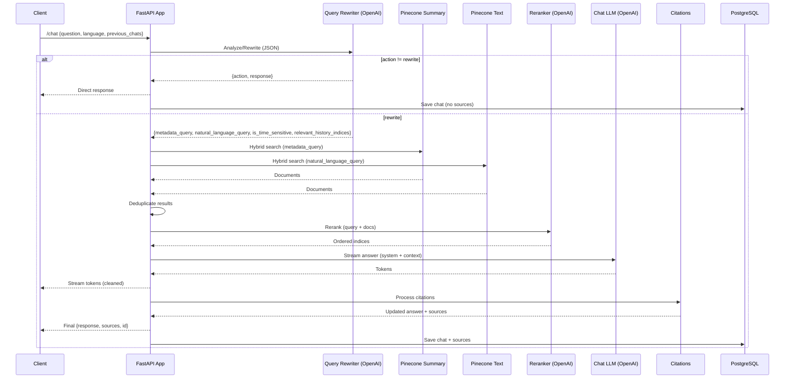
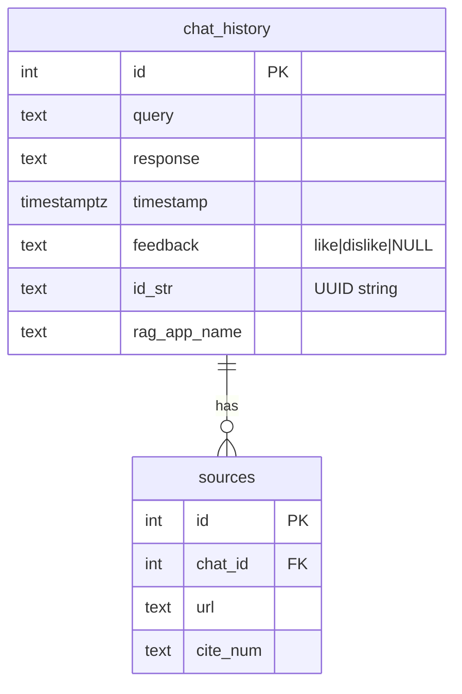

# LAWA RAG Agent

A modular RAG (Retrieval-Augmented Generation) system for MBZUAI BSE undergraduate program queries with query rewriting, context filtering, and domain-specific knowledge expansion.

## Project Structure

The project is organized into modular components:

```
lawa-rag-agent/
├── app.py                    # Main application entry point and API endpoints
├── modules/                  # Modular components
│   ├── __init__.py           # Makes modules a package
│   ├── config.py             # Configuration, environment variables, system prompt
│   ├── citations.py          # Citation processing utilities
│   ├── query_rewriting.py    # Query rewriting and domain knowledge expansion
│   ├── retrieval.py          # Document retrieval and reranking
│   ├── schemas.py            # Pydantic models for data validation
│   └── utils.py              # Utility functions
├── .env                      # Environment variables (not in version control)
└── MBZUAI_BM25_ENCODER.json  # BM25 sparse vectors for hybrid search
```

## Setup

1. Create a virtual environment:
   ```
   python -m venv venv
   source venv/bin/activate  # On Windows: venv\Scripts\activate
   ```

2. Install dependencies:
   ```
   pip install -r requirements.txt
   ```

3. Set up environment variables by creating a `.env` file (minimal set shown):
   ```
   # Required
   OPENAI_API_KEY=your_openai_api_key
   PINECONE_API_KEY=your_pinecone_api_key

   # Optional (recommended)
   PINECONE_SUMMARY_INDEX_NAME=mbzuai-summary-only-index-latest
   PINECONE_TEXT_INDEX_NAME=mbzuai-text-only-index-latest
   HYBRID_ALPHA=0.5
   EMBEDDING_MODEL_NAME=Qwen/Qwen3-Embedding-0.6B
   BM25_FILE_PATH=./MBZUAI_BM25_ENCODER.json
   OPENAI_TIMEOUT=30
   CORS_ALLOW_ORIGINS=*
   RAG_APP_NAME=default_rag_app
   # Preferred new variable for tagging chats in DB. Defaults to MAIN when unset.
   CHAT_APP_NAME=MAIN

   # Database (asyncpg)
   MBZUAI_PG_HOST=localhost
   MBZUAI_PG_PORT=5432
   MBZUAI_PG_USER=postgres
   MBZUAI_PG_PASSWORD=postgres
   MBZUAI_PG_DATABASE=mbzuai_database
   ```

4. Run the application:
   ```
   uvicorn app:app --reload
   ```

## API Endpoints

- WebSocket: `/chat` - For real-time chat interactions
- HTTP POST: `/telegram-chat` - For Telegram bot integration
- HTTP GET: `/health` - Health check endpoint

## Features

- **Query Rewriting**: Rewrites user queries for better retrieval performance
- **Message History Filtering**: Keeps only relevant conversation context
- **Domain Knowledge Expansion**: Enhances queries with MBZUAI BSE-specific terminology
- **Out-of-Scope Detection**: Directly responds to queries outside the system's scope (including Masters/PhD queries)
- **Clarification Requests**: Asks for more information when queries are ambiguous
- **Citation Processing**: Extracts and formats citations from responses
- **Dual-index Hybrid Retrieval**: Combines dense embeddings + BM25 sparse retrieval across Summary and Text indexes
- **Reranking**: LLM-guided reranking with metadata-aware instructions
- **Production-friendly Failures**: Clear, non-technical user messages for retrieval/generation/timeouts; no external web fallback

## Architecture overview and startup lifecycle

- Loads `.env`; validates required secrets.
- Creates PostgreSQL pool (asyncpg) and bootstraps schema (`chat_history`, `sources`, indexes, schema version table).
- Initializes retrieval components:
  - Dense: `HuggingFaceEmbeddings` (`EMBEDDING_MODEL_NAME`)
  - Sparse: `BM25Encoder` from `BM25_FILE_PATH`
- Connects to Pinecone `summary` and `text` indexes.
- Stores handles in `app.state` for request-time usage.

## End-to-end pipeline (WebSocket `/chat`)

1. Client sends `{question, language, previous_chats}` (validated via `ChatRequest`).
2. Query analyzer (OpenAI) returns:
   - `rewrite`: `metadata_query`, `natural_language_query`, `is_time_sensitive`, `relevant_history_indices`
   - or `clarify`/`respond`/`identity`: app replies directly and saves.
3. History selection: only relevant messages (and immediate assistant replies) are kept.
4. Retrieval (concurrent):
   - Summary index ← `metadata_query`
   - Text index ← `natural_language_query`
   - Hybrid search (dense + BM25); deduplicate by `page_id` or `page_source+chunk_id`.
5. Reranking (OpenAI): top pool of docs is ordered by relevance using a metadata-aware prompt; order preserved.
6. Answer generation (OpenAI, streaming):
   - Messages: `system(get_system_prompt) + relevant_history + user(format_query(question, language, ranked_docs))`
   - Tokens streamed to client with inline `[n]` markers stripped during streaming.
   - Friendly errors for rate limit/timeout/generic issues.
   - If model signals no answer, app returns a supportive message asking for more specifics.
7. Citations: post-stream, normalize `[n]` → `[n](url)` using `ranked_docs` metadata (`page_source`), deduplicate.
8. Persistence: save `{query, response, id_str, rag_app_name}` to `chat_history`; save citations to `sources`.

### Sequence diagram



## HTTP pipeline (POST `/telegram-chat`)

- Follows the same logic (rewrite → retrieve → rerank → generate → cite → save) but returns a single HTTP response.
- Retrieval errors: 500 with a friendly message (“I’m having trouble retrieving information right now…”).
- No relevant documents: 404 with a helpful rephrasing suggestion.
- If no answer is possible: a supportive “try rephrasing with more details”.

## Data movement and contracts

- Request (client → app): `ChatRequest`
  - `question: str`, `language: str`, `previous_chats: List[dict]`
- Query Rewriter (app → OpenAI): strict JSON output via `response_format`.
- Retrieval (app → Pinecone): returns LangChain `Document` objects
  - `page_content: str`, `metadata: { page_source, document_title, document_summary, keywords, page_id? }`
- Reranker (app → OpenAI): returns ordered indices to preserve.
- Chat LLM (app → OpenAI): streamed tokens consumed and relayed to clients.
- Citations: maps inline `[n]` to `ranked_docs[n-1].metadata.page_source` and builds `{url, cite_num}` list.
- Response (app → client): `{response: str, sources: List[{url, cite_num}], id: UUIDv4}`

## Storage model



Indexes:
- `idx_chat_history_timestamp` on `chat_history.timestamp`
- `idx_chat_history_id_str` on `chat_history.id_str`
- `idx_sources_chat_id` on `sources.chat_id`

## Health and operations

- `GET /health` validates:
  - DB: pool + `SELECT 1`
  - Retrieval components loaded
  - Pinecone indexes present
- Graceful shutdown closes the DB pool.
- CORS: `CORS_ALLOW_ORIGINS` (comma-separated) or `*` (auto-disables credentials).

## Failure behavior (user-facing)

- Retrieval error: “I’m having trouble retrieving information right now. Please try again later.”
- No relevant documents: “I couldn’t find enough MBZUAI-specific information… Try rephrasing with more details (e.g., program name, semester, deadline).”
- Generation rate limit: “I’m receiving too many requests right now. Please try again shortly.”
- Generation timeout: “This is taking longer than expected. Please try again with a simpler or more specific question.”
- Generic generation error: “I ran into an issue while generating a response. Please try again later.”
- No-answer case: “I couldn’t generate a confident answer right now. Try rephrasing with more details (e.g., program, year, topic) or ask a simpler version.”